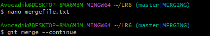

# Лабораторная работа №6
## Шаги выполнения
---
### 1. Создание аккаунта на GitHub


### 2. Fork репозитория
 

### 3. Установка Git


### 4. Настройка Git
```bash
git config --global user.name "В3441 <Башкиров Д.В."
git config --global user.email "daniaivanov10@gmail.com"
```


### 5. Клонирование репозитория
```bash
git clone https://github.com/Avokadiik/LR6.git
```


### 6. Добавление файла через интерфейс GitHub и подтяжка его в локальный репозиторий
```bash
git pull
```


### 7. Получение истории операций
```bash
git log
```


### 8. Просмотр последних изменений
```bash
git diff
```


### 9. Слияние в ветку master и разрешение конфликта
```bash
git merge branch1
```   




### 10. Удаление побочной ветки
```bash
git branch -d branch1
```


### 11. Фиксация изменений
```bash
git add .
git commit -m "comment"
```


### 12. Откат коммита
```bash
git reset --hard HEAD~1
```


### 13. Создание ветки для отчёта
```bash
git checkout -b report
```


### 14. Оформление отчёта
Скриншоты помещены в папку PrtSc.

### 15. История операций
```bash
git log --pretty=format:"%h %ad %an %s" --date=short
```


### Лог команд
```bash
git clone https://github.com/Avokadiik/LR6.git
git pull
git log
git diff
git merge branch1
git branch -d branch1
git add .
git commit -m "comment"
git reset --hard HEAD~1
git checkout -b report
git log --pretty=format:"%h %ad %an %s" --date=short
git push
```
